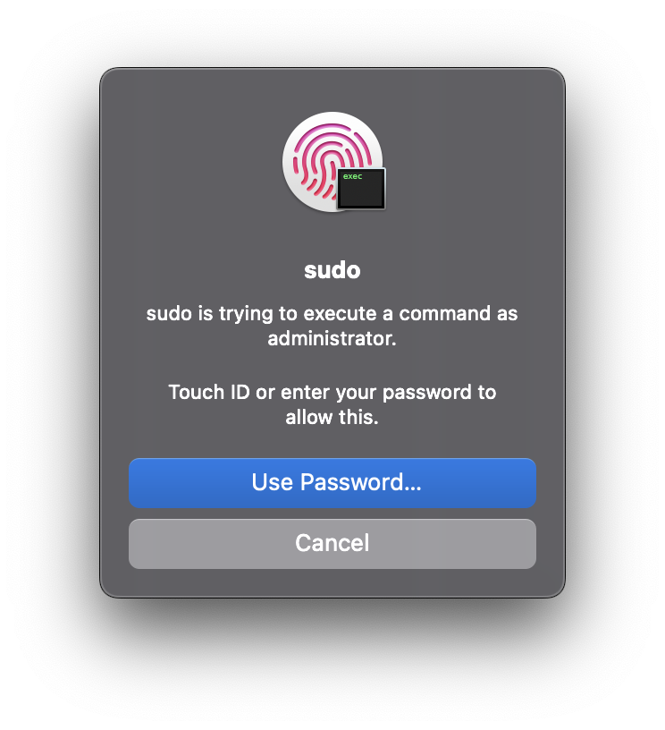

# perpetual-touch-id-for-sudo



## Why does this exist?

Did you know Touch ID can be used for passwordless sudo in your terminal on macOS?  You just need to add the following line into your `/etc/pam.d/sudo` file:

```
auth sufficient pam_tid.so
```

But there's one major problem: every time you upgrade macOS, the updater blows this change away.

This script helps you keep your `/etc/pam.d/sudo` up-to-date so you don't need to fix this file with every system upgrade.

## How to Use

Drop `pam_tid.py` somewhere on your file system.  I keep mine at `~/.local/bin/pam_tid.py`.  I made mine executable with the following:

```bash
chmod u+x ~/.local/bin/pam_tid.py
```

Add the following function into your shell `rc` file.  Because I use bash, I appended this to my `.bashrc`:

```bash
function sudo {
    ${HOME}/.local/bin/pam_tid.py --check || echo "Enabling Touch ID for sudo..."; /usr/bin/sudo ${HOME}/.local/bin/pam_tid.py
    /usr/bin/sudo "$@"
}
```

That's it!  Now if you try to run `sudo` and the Touch ID isn't enabled, it'll fix it before proceeding.  
